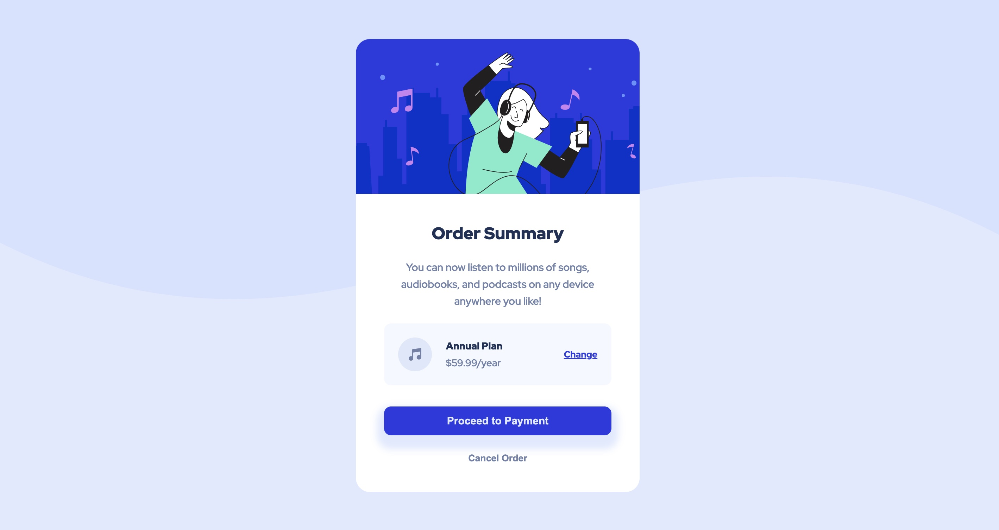
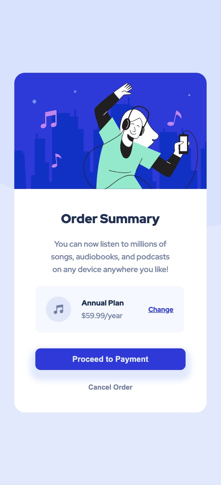

# Frontend Mentor - Order summary card solution

This is a solution to the [Order summary card challenge on Frontend Mentor](https://www.frontendmentor.io/challenges/order-summary-component-QlPmajDUj). Frontend Mentor challenges help you improve your coding skills by building realistic projects. 

## Table of contents

- [Overview](#overview)
  - [The challenge](#the-challenge)
  - [Screenshot](#screenshot)
  - [Links](#links)
- [My process](#my-process)
  - [Built with](#built-with)
  - [What I learned](#what-i-learned)
  - [Continued development](#continued-development)
- [Author](#author)


## Overview

### The challenge

Users should be able to:

- See hover states for interactive elements

### Screenshot





### Links

- Solution URL: [My Solution](https://www.frontendmentor.io/solutions/order-summary-component-solution-ZlfWLRlSyC#comment-66f49a705832c087f249463b)
- Live Site URL: [Check it out!](https://clipzorama.github.io/Order-Summary-Design/)

## My process

### Built with

- Semantic HTML5 markup
- CSS custom properties
- Flexbox
- CSS Grid
- Mobile-first workflow
- SVGs for scalable, lightweight graphics
- Layering elements with z-index and positioning
- Responsive design with media queries

### What I learned

- Properly layering SVG elements behind components like cards.

- Implementing z-index and relative positioning to control the stacking order.

- More about SVG customization and incorporating scalable vector graphics seamlessly into the design.


**If you look inside of the index.html file, you will see the SVG elements implemented. Down Below is just a snippet of what was implemented**

```html
<div class="details">
<h2 class="sum">Order Summary</h2>
<p class="sum-details">
    You can now listen to millions of songs,
    audiobooks, and podcasts on any device
    anywhere you like!
</p>

<div class="musi-plan">
```

```css
svg {
    position: absolute;
    top: 0;
    left: 0;
    width: 100%;
    height: 100%;
    z-index: 0;
    /* card would be on top as the svg is in the background */

}

.hero {
    position: relative;
    z-index: 1;
    border-radius: 20px 20px 0 0;
    width: 100%;
    height: 220px;
    object-position: center;
    object-fit: contain;
}
```

### Continued development

- Add animations to the buttons for smoother transitions.
Implement a dark mode to enhance user accessibility.

- Consider adding hover effects on the card components for a more interactive user experience.

- Expand the mobile layout with more refined adjustments for various screen sizes.

## Author

- Frontend Mentor - [@Clipzorama](https://www.frontendmentor.io/profile/Clipzorama)

